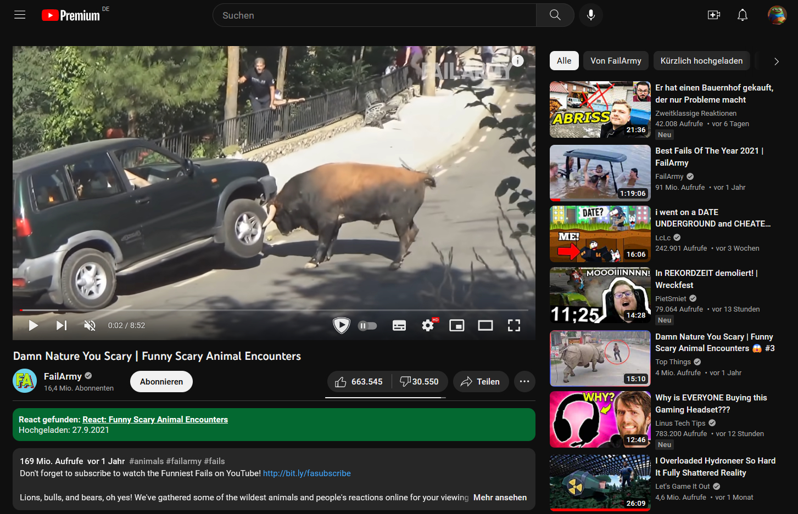
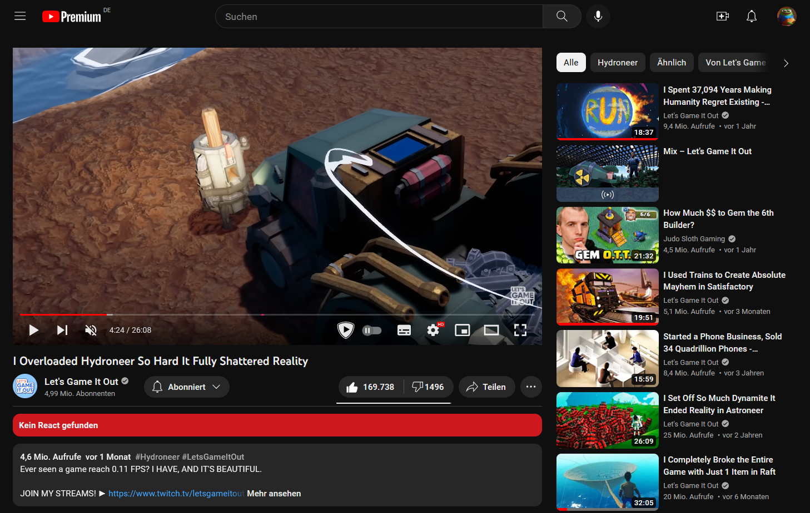

    

    <h2>PietSmiet Reaction Extension</h2>
    
Ein simpler Banner unter Youtube Videos zeigt an, ob auf das Video schon reagiert wurde. Das Ziel des Ganzen ist dabei den Jungs zu helfen, weniger auf dopplte Videos zu reagieren. Ob das klappt? Wir werden's sehen 😅

    
    
    
    
    

## **Screenshots**

| Gefunden                    | Nicht gefunden             |
| --------------------------- | -------------------------- |
|  |  |

## **Getestete Browser**

Folgende Liste hab ich getestet. Andere Browser sollten auch ohne Probleme klappen

- Chrome 109.0.5414.120
- Edge 110.0.1587.50
- Brave 1.48.167
- Firefox 110.0

## **Wie funktioniert das Ganze?**

1. Ich verwende die Youtube Api um alle Videos der "Uploads" Playlist des [@PietSmietTV](https://www.youtube.com/@PietSmietTV)-Kanals abzufragen. Die ganze Abfrage wird in [youtube.json](./data/youtube.json) gespeichert.
2. Dann wird der Titel nach "react" durchsucht und geprüft, ob die Beschreibung "Original(-)Video" enthält (das - ist optional), um sicher zu gehen, dass das Video auch wirklich verlinkt ist. Wenn beides zutrifft, wird die Beschreibung nach YouTube-Links durchsucht und dann in [matches.json](./data/matches.json) geschrieben.
3. Github Actions führt immer um 00:00 Uhr einen Workflow aus, der die Matches aufgrund der täglichen Video-Uploads neu generiert.
4. Die Browser Extension holt sich dann die [matches.min.json](./data/matches.min.json), prüft ob die aktuelle VideoID der Browser URL in den Matches enthalten ist und fügt entsprechend die Box unter dem Video ein.
