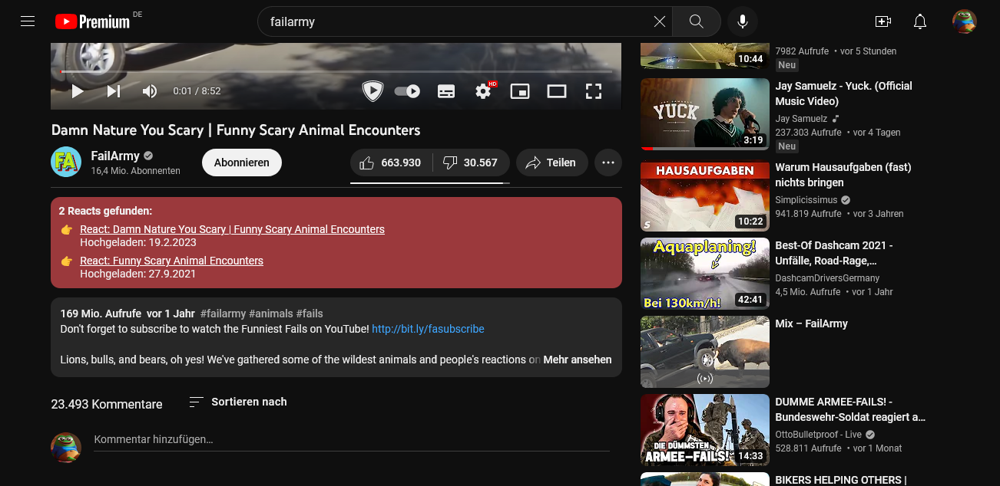

    

    <h2>PietSmiet Reactions YouTube</h2>
    
Ein einfacher Banner unter den Youtube-Videos zeigt an, ob auf das Video bereits reagiert wurde. Das Ganze soll den Jungs helfen, weniger auf doppelte Videos zu reagieren. Ob das funktioniert? Mal sehen 😅

    
    
    
    
    

## **Downloads**

- [Chrome Web Store](https://chrome.google.com/webstore/detail/pietsmiet-reactions/cmeffgcdjkledgkgonnfjpnlfelpfbkf)
- [Firefox Add-Ons](https://addons.mozilla.org/de/firefox/addon/pietsmiet-reactions-youtube/)
- [Microsoft Edge-Add-Ons](https://microsoftedge.microsoft.com/addons/detail/pietsmiet-reactions-youtu/meeaaoacaejacaffangpimamghedhead)

Bei Firefox muss dem Addon nach dem installieren noch die Erlaubnis erteilt werden, auf youtube.com und pietsmiet.de zuzugreifen:

## **Getestete Browser**

Folgende Liste hab ich getestet. Andere Browser sollten auch ohne Probleme klappen

- Chrome 109.0.5414.120
- Edge 110.0.1587.50
- Brave 1.48.167
- Firefox 110.0

## **Screenshots**

### **YouTube.com**

| Gefunden                                                                                                                        | Nicht gefunden                                                                                                                        |
| ------------------------------------------------------------------------------------------------------------------------------- | ------------------------------------------------------------------------------------------------------------------------------------- |
|  |  |

### **PietSmiet.de**

| Alle Vorschläge                                                                                                                                         | Einzeln gefunden                                                                                                                                                          | Einzeln nicht gefunden                                                                                                                                                          |
| ------------------------------------------------------------------------------------------------------------------------------------------------------- | ------------------------------------------------------------------------------------------------------------------------------------------------------------------------- | ------------------------------------------------------------------------------------------------------------------------------------------------------------------------------- |
|  |  |  |

### **Popup**

| Hauptfenster                                                                                                    | Color Picker                                                                                                                |
| --------------------------------------------------------------------------------------------------------------- | --------------------------------------------------------------------------------------------------------------------------- |
|  |  |

## **Wie funktioniert das Ganze?**

1. Ich verwende die Youtube Api um alle Videos der "Uploads" Playlist des [@PietSmietTV](https://www.youtube.com/@PietSmietTV)-Kanals abzufragen. Die ganze Abfrage wird in [youtube.json](./data/youtube.json) gespeichert.
2. Dann wird der Titel nach "react" durchsucht und geprüft, ob die Beschreibung "Original(-)Video" enthält (das - ist optional), um sicher zu gehen, dass das Video auch wirklich verlinkt ist. Wenn beides zutrifft, wird die Beschreibung nach YouTube-Links durchsucht und dann in [matches.json](./data/matches.json) geschrieben.
3. Github Actions führt immer um 16:00 Uhr einen Workflow aus, der die Matches aufgrund der täglichen Video-Uploads neu generiert. Github verschiebt bei "high load" Uhrzeiten (zur vollen Stunde) die Workflows zu Zeiten wenn weniger Last ist. Es kommt also öfter vor, dass Github den Workflow einfach zu einem komplett anderen Zeitpunkt ausführt.
4. Die Browser Extension holt sich dann die [matches.min.json](./data/matches.min.json), prüft ob die aktuelle VideoID der Browser URL in den Matches enthalten ist und fügt entsprechend die Box unter dem Video ein.
